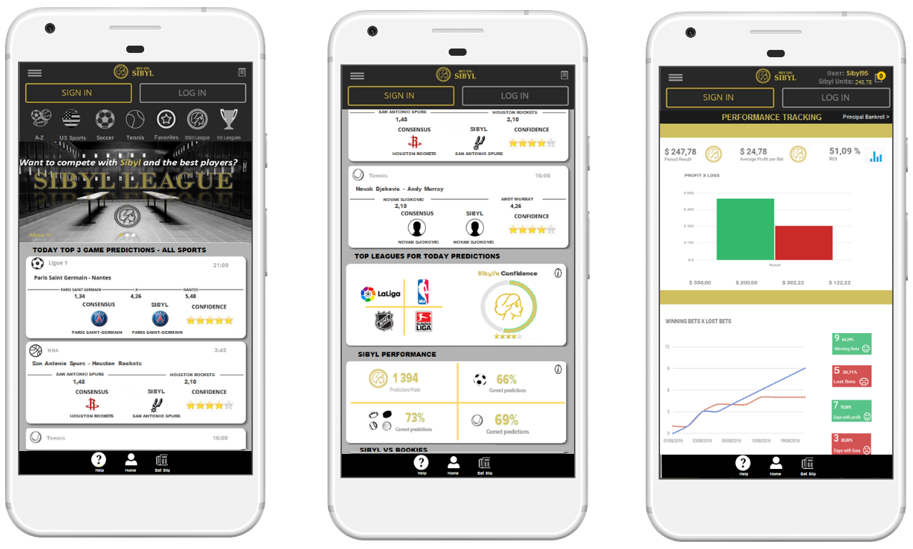
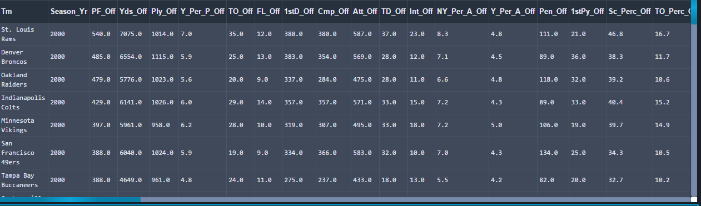
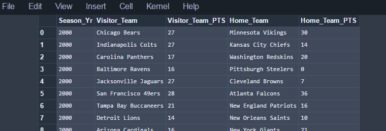
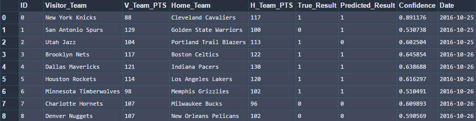
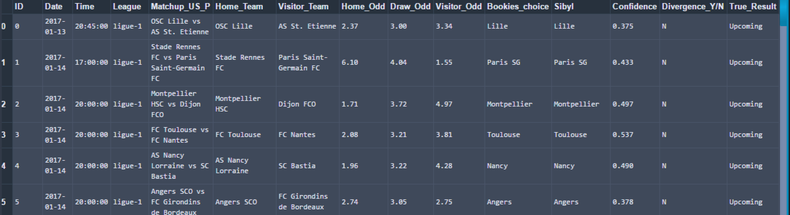

============================================

Sport Game Outcome Prediction Project - Bet on Sibyl 
======================
### Bet on Sibyl in a nutshell

BetonSibyl is a platform controlled by a set of algorithmic models (a model defined for each sport)
that projects accurately estimated results (predictions of upcoming games) from a multitude of statistical variables.
At launch, the platform will cover the four major US sports (Football, Basketball, Baseball, Hockey), Soccer and Tennis.
Moreover, the models provide stats to measure the
performance of the algorithm for the current season (for each sport) along with bankroll comparaison stats with bookmaker 
(scraping from the [oddsportal's website](http://www.oddsportal.com/) to do so). Here's below an image from the mobile app 
propotype based on the platform.

## Table of content

- [Data collection](#data-collection)
    - [Decomposition - Data Design Decisions](#data-design-decisions)
    - [Web Scraping - Selenium/Beautiful Soup](#web-scraping)
- [Predictions](#predictions)
    - [Data Preprocessing](#data-preprocessing)
    - [Algorithm Tuning and Running](#algorithm-tuning-and-runing)
- [Results Presentation](#results-presentation)
    - [Bookmakers comparaison over the year](#bookmakers-comparaison-over-the-year)
    - [Model Performance Metrics](#model-performance-metrics)
    - [ML one-sport process in a nutshell](#ml-one-sport-process-in-a-nutshell)
- [License](#license)
- [Links](#links)
- [Notes](#notes)

## Data collection

### Data Design Decisions

1. It is decided that the two participating teams/players in each matchup are respectively represented by visitor team and home team (player A/player B in case of Tennis).
 This is contrary to another popular method of representing the teams as the favorite and underdog.

2. The point differential is chosen to be positive when the home team scores more points than the away team.

3. To represent the difference between the two teams that are playing in the matchup, the ratio or the difference between
 the same attributes are taken between the two teams. That is, the home team’s statistic is divided by the visitor team’s
  statistic. Therefore, when attributes are a positive indicator of performance, a value greater than 1 indicates that
   the home team performs better for that particular attribute. When the attributes are integers (not statistics), then 
   the difference between the home team’s attribute and the away team’s attribute is taken. Examples of this are win 
   streak, compared to statistics such as points per game that would be compared by taking the ratio.

### Web Scraping

The data is scraped from several websites according to each sport using Python and the Selenium and BeautifulSoup (only for MLB data)
 packages for Python. Data sources for each sports are described in the "Link" section. 
 According to each sport/league, the script goes through each summary season page and writes season team stats and season game stats 
 (e.g. date, the home team, away team, home team points, away team points etc.) to a csv file.
Game stat data, team stat data, and datetime data are merge later into a feature file (.npz) for the ML algorithm (Lasso Logistic Regression)
Here's below an example team stats data and game stats data for the NFL league.
In the same scripts, After having obtained the raw data set, data is cleaned throughout the script. The script
checked the completeness and validity of all the data files, and eliminated any CSV parsing errors
or erroneous data values.
 
ex of NFL team stat data from the 2000 season to the 2015 season

ex of NFL game stat data from the 2000 season to the 2015 season

## Predictions

### Data preprocessing

Data preprocessing is made in the Prepare_for_ML.py file. Here is the main idea:
Having validated all our available data, the script then proceeded to load the data from the csv files
into an SQL database using the SQLite single-file database engine and a few Python scripts. The
flexibility of SQL queries allowed one to easily perform complex joins and merges between multiple
tables via the the script.
Instead of using each team’s attribute independently in the analysis, attributes are formed to represent the difference
 between the attribute for the two participating teams in the matchup. For example, in the NBA league the attributes 
 ‘average_blocks_per_game_home’ and ‘average_blocks_per_game_away’ are not used in the analysis, rather, 
 the ratio between the two values is used. 
 
 Thus, the script converts the clean scraped data to data structures that the libraries in scikit-learn can easily use. 
 The ultimate result of the routines included in this file is a numpy array containing all the features and game results
  for the historical game data. The structure 'features.npz' contains this output and is eventually loaded by scikit-learn.
   The features have not been normalized but the next script provide one the ability to easily normalize or standardize the data. 

### Algorithm Tuning and Running

This step is located in the "RunModelLeague.py"
According to each sport, it uses scikit-learn and historical game results (in the .npz file) to make predictions on the current season games
 that have not been played.
 A logistic regression predictive model with the L1 penalty is created. Analysis of results are output to csv files.

 Here is below an example of the output for the 2017 nba season
 
 
 
 Then, webscraping (through the ScrapeMatchupDatetimeOddsTwoChoicesLeague.py file) is performed  through the betbrain's website so as one can have more information on each league upcoming match.
Thus, the final output give additionnal detail such as odds for both home and away teams, the choice of the bookmaker 
(e.g. the team with the lowest odd if designed to be the bookmaker choice), the choice of the algorithm (Sibyl), if 
there is a divergence or no between Sibyl and the bookmaker ('Y' = yea, 'N' = no).
Here's below an example of the final output for the Ligue 1 soccer league.

 

## Results Presentation
 

### Model Performance Metrics

First of all, webscraping (through the SibylVsBookiesNFL.py file) is performed in order to have sufficient data to make comparison with
bookmakers over the year ([oddsportal's website](http://www.oddsportal.com/)). 
Below you can see an example of output that help one make a clear performance comparison between Sibyl and the bookies 
for the 2016 MLB season.

 
 
Then, algorithm performance measure is performed through the ModelMetricsLeague.py file
The script provides one for a given league data such as algorithm accuracy (e.g. % of correct predictions) up-to-date, the team of the month to
bet on (team which has performed well when chosen by the algorithm), the worst team of the month, The top teams to bet on 
based on the divergence stategy etc...

### ML one-sport process in a nutshell

For a given league, the entire process described above can be run via the ModelLeague.py file.
Here is an example of the process code for the 

    # coding: utf-8
    
    import numpy as np
    import sys
    
    
    class ModelNHL(object):
        from RunModelNHL import NHLMakePredictions
        from ScrapeMatchupDatetimeOddsTwoChoicesNHL import AcquireMatchupDatetimeOddsTwoChoices
        from SibylVsBookiesNHL import AcquireSibylVsBookiesNHL
        from ModelMetricsNHL import ModelMetricsNHL
    
        def __init__(self, current_season, feature_file, nhl_db_name,
                     betbrain_upcoming_games_url, cs_team_stats_filename, league_name, upcoming_games_output_filename_us,
                     upcoming_games_output_filename_eu, oddsportal_url_fix, oddsportal_url_list_format):
            self.current_season = current_season
            self.feature_file = feature_file
            self.data = np.load(feature_file)
            self.tableau_input_filename = "nhl_tableau_output_" + str(current_season) + ".csv"
            self.current_season = current_season
            self.X = self.data['X']
            self.y = self.data['y']
            self.nhl_db_name = nhl_db_name
            self.betbrain_upcoming_games_url = betbrain_upcoming_games_url
            self.cs_team_stats_filename = cs_team_stats_filename
            self.league_name = league_name
            self.upcoming_game_outputs_filename_us = upcoming_games_output_filename_us
            self.upcoming_games_output_filename_eu = upcoming_games_output_filename_eu
            self.oddsportal_url_fix = oddsportal_url_fix
            self.oddsportal_url_list_format = oddsportal_url_list_format
            self.cs_team_stats_filename = cs_team_stats_filename
            self.season_over = 'No'
    
        def __call__(self):
            print "NHL Machine Learning process execution..."
            x = self.NHLMakePredictions(self.current_season, self.feature_file, self.nhl_db_name)
            x()
            print "NHL Machine Learning process execution...OK\n"
    
            print "NHL Scraping odds and datetime from Betbrain.com process execution..."
            w = self.AcquireMatchupDatetimeOddsTwoChoices(
                self.season_over,
                self.betbrain_upcoming_games_url,
                self.cs_team_stats_filename, self.league_name,
                self.tableau_input_filename,
                self.upcoming_game_outputs_filename_us,
                self.upcoming_games_output_filename_eu)
            w()
            print "NHL Scraping odds and datetime from Betbrain.com process execution...OK\n"
    
            # ----------------------------------------------------------------------------
    
            self.season_over = w.season_over
            print self.league_name + ' season is over? : ' + self.season_over + '=> '
            if self.season_over == 'No':
                print "Moving on...\n"
            else:
                print "Season over => Stopping the NHL process\n"
    
            # ----------------------------------------------------------------------------
    
            print "NHL Sibyl vs Bookies process execution..."
            v = self.AcquireSibylVsBookiesNHL(self.season_over, self.oddsportal_url_fix, self.oddsportal_url_list_format,
                                              self.cs_team_stats_filename, self.tableau_input_filename)
            v()
            print "NHL Sibyl vs Bookies process execution...OK\n"
    
            print "NHL ModelMetrics process execution..."
            u = self.ModelMetricsNHL(self.season_over, self.tableau_input_filename, self.upcoming_game_outputs_filename_us,
                                     self.cs_team_stats_filename)
            u()
            print "NHL ModelMetrics process execution...OK\n"
    
    
    if __name__ == '__main__':
        x = ModelNHL(2017, 'nhl_features_2006_2015.npz', 'nhl_team_data_2017.db',
                     'https://www.betbrain.com/ice-hockey/united-states/nhl/', 'nhl_team_stats_2017_2017.csv', 'NHL',
                     'NHL_Upcoming_Matchups_US_P_df.csv', 'NHL_Upcoming_Matchups_EU_P_df.csv',
                     'http://www.oddsportal.com/hockey/usa/nhl/results/',
                     'http://www.oddsportal.com/hockey/usa/nhl/results/#/page/{}/')
        x()

Nb: the script does not take argument.

## License

The Bet on Sibyl is licensed under the terms of the GPL Open Source
license and is available for free.

## Links
Here are all the website sources for data web scraping:
* [http://www.baseball-reference.com/](http://www.baseball-reference.com/) (Beautiful Soup)
* [http://www.basketball-reference.com/](http://www.basketball-reference.com/) (Selenium/Phantom JS)
* [http://www.pro-football-reference.com/](http://www.pro-football-reference.com/) (Selenium)
* [http://www.hockey-reference.com/](http://www.hockey-reference.com/) (Selenium)
* [http://www.soccerstats.com/](http://www.soccerstats.com/) (Selenium)
* [http://www.coretennis.net/](http://www.coretennis.net/) (Selenium/ Phantom JS)
* [http://www.oddsportal.com](http://www.oddsportal.com) (Selenium)
* [https://www.betbrain.com](https://www.betbrain.com) (Selenium)

Here is the link for the mobile app prototype:
* [https://marvelapp.com/31dgaj4/screen/17384930](https://marvelapp.com/31dgaj4/screen/17384930)

## Notes

All us leagues and soccer leagues models are done. 
Tennis model is ongoing but partially finished. 
Any recommendation, help for the model would be much appreciated.
Enjoy!

Tool used: Ananconda Distribution through Pycharm (Professional version) + Jenkins / Jupyter Notebook / SQLite Browser
